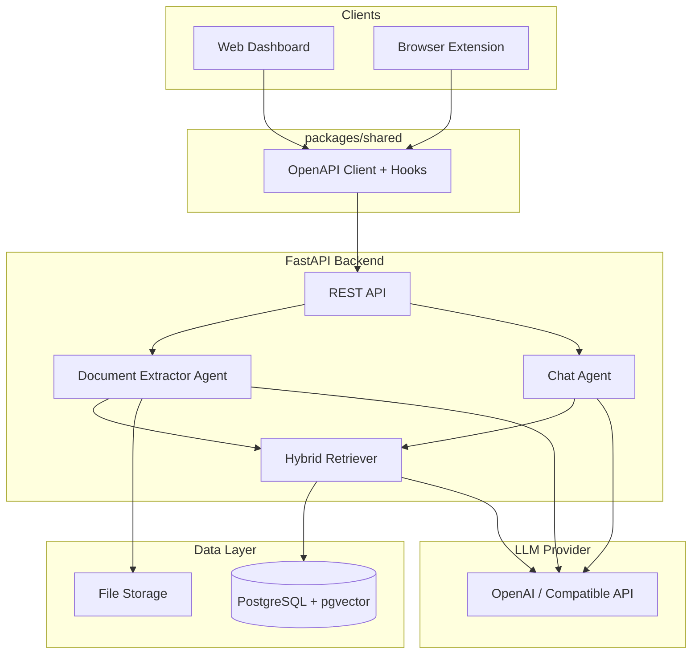

# RAG Agent — Multi-Tenant Document Assistant

A full-stack **Retrieval-Augmented Generation (RAG)** platform for internal call-center and support teams. Operators upload customer-specific knowledge bases (PDF, Markdown, text, etc.), then chat with an AI assistant that answers **strictly from those documents**. The system supports **multiple customers (tenants)**, **sector-aware prompting** (banking, telecom, energy), a **web dashboard**, and a **browser extension** widget for agents working on any webpage.

Built as a monorepo on the [FastAPI full-stack template](https://github.com/fastapi/full-stack-fastapi-template), extended with vector search, document ingestion, and agentic chat flows.

---

## Project scope

| Area | Description |
|------|-------------|
| **Problem** | Support agents need fast, accurate answers from large, customer-specific document sets without leaving their workflow. |
| **Solution** | Upload documents → automatic extraction & indexing → semantic chat scoped per customer. |
| **Users** | Superusers (admin), moderators (document managers), viewers (chat-only). |
| **Languages** | Optimized for **Greek** queries and documents (Q&A chunking, query expansion, prompts). |
| **Deployment** | Docker Compose (local/staging/production), optional Ollama or OpenAI-compatible LLM. |

---

## Highlights (for evaluation)

1. **End-to-end RAG pipeline** — ingest → chunk → embed → retrieve → generate, with observability via stored `rag_trace` on every assistant message.
2. **True multi-tenancy** — documents, chunks, embeddings, and chat history are isolated by `customer_id`.
3. **Hybrid retrieval** — pgvector cosine similarity plus keyword fallback when embeddings are unavailable.
4. **LLM query expansion** — short/vague user questions are expanded into multiple search queries before retrieval.
5. **Sector-aware agent** — per-customer sector profiles, few-shot examples, and dynamic sector override from user message keywords.
6. **Confidence & clarification** — rule-based retrieval confidence scoring; UI distinguishes **answers** vs **clarification** responses.
7. **Human feedback loop** — thumbs up/down with structured reasons on assistant messages.
8. **Dual client surfaces** — React web app + Chrome/Edge extension sharing one `@rag-agent/shared` package.
9. **Graceful degradation** — works without an LLM (preview/fallback modes) for development and demos.
10. **Test coverage** — pytest for chat, documents, RAG confidence, chunking, and prompts.

---

## Architecture



### Monorepo layout

```
├── backend/          # FastAPI, SQLModel, Alembic, RAG agents
├── frontend/         # React + Vite + TanStack Router (admin & chat UI)
├── extension/        # Chrome/Edge content script + chat panel
├── packages/shared/  # OpenAPI client, auth, chat hooks, feedback UI
├── compose.yml       # Docker stack (Postgres/pgvector, Traefik, etc.)
└── development.md    # Detailed dev setup
```

---

## Key features

### Document management
- Upload `.txt`, `.md`, `.pdf`, `.csv`, `.json` (max 25 MB configurable).
- Background extraction: LLM summary + raw text stored in JSONB.
- Automatic chunking and embedding index on completion.
- Re-extract and delete documents (moderator+).
- Per-customer upload directories.

### Chat
- Customer-scoped conversation history (last N messages in context).
- Source document titles shown on assistant replies.
- `response_kind`: `answer` or `clarification` (highlighted in UI).
- Message feedback: `positive` / `negative` with reasons (`wrong`, `incomplete`, `outdated`, `off_topic`, `other`).

### Admin & multi-tenancy
- **Customers** — name, description, sector (`banking`, `telecom`, `energy`, `general`), active flag.
- **Users** — JWT auth, roles (`viewer`, `moderator`), superuser flag.
- Viewers: chat only. Moderators: documents + chat. Superusers: customers + users.

### Browser extension
- Floating chat widget on any webpage.
- Viewer login, customer picker, same chat API as the web app.
- See [extension/README.md](./extension/README.md) for build and store submission.

---

## AI patterns & design decisions

### 1. Retrieval-Augmented Generation (RAG)
The chat agent does **not** rely on model parametric knowledge for facts. Retrieved chunks are injected into the system prompt under **Document knowledge**, with explicit grounding rules and a Greek fallback when context is insufficient.

**Flow:** user message → query expansion → hybrid retrieval → system prompt + few-shots + history → LLM completion → `rag_trace` persisted.

### 2. Document extraction agent
On upload, a separate **extraction agent** reads file text and produces a structured summary (topics, facts, actionable items). This runs in a background task while chunks are indexed for search.

### 3. Intelligent chunking
- **Q&A-aware:** Greek/English `Ερώτηση/Question` … `Απάντηση/Answer` blocks become dedicated `qa` chunks (ideal for FAQ corpora).
- **Generic fallback:** paragraph-based splitting with configurable size (1500) and overlap (200).

### 4. Hybrid retrieval
| Method | When | How |
|--------|------|-----|
| **Vector search** | Embeddings available | Cosine distance via pgvector, filtered by `customer_id` and `completed` documents |
| **Keyword search** | No embeddings or empty vector results | Token overlap scoring with Greek normalization |

Results from expanded queries are merged; best score per chunk wins; top-K returned (default 5).

### 5. LLM query expansion
Short queries (≤4 words) get extra expansion variants. The LLM produces synonym/alternate phrasings in JSON; each variant is embedded and searched. Improves recall for shorthand Greek (e.g. “μπλόκο καρτα” → card block procedures).

### 6. Sector-aware prompting (domain adaptation)
Each customer has a **sector**. The system prompt includes a sector profile (tone, typical topics). **Few-shot examples** per sector demonstrate format without inventing facts.

**Dynamic sector override:** keyword hints in the user message can temporarily switch the effective sector (e.g. banking customer asking about internet → telecom profile) when keyword score exceeds threshold.

### 7. Retrieval confidence & clarification
Rule-based `assess_retrieval_confidence` evaluates:
- No chunks / low max score
- Multi-document ambiguity (similar scores across documents)
- Short vague queries

Triggers feed `clarification_recommended`. The prompt instructs the LLM to ask 1–2 clarifying questions instead of guessing. Post-generation, `classify_response_kind` detects clarification phrasing in the reply.

### 8. RAG trace (observability)
Every assistant message stores JSON metadata:
- Model, top-K, expanded queries
- Retrieved chunks (id, document, score, rank)
- Confidence level, triggers, `response_kind`
- Fallback context flag

Useful for debugging, grading, and future analytics.

### 9. Chat history in context
Last 6 messages (configurable) are included in the LLM call for follow-up questions while keeping token use bounded.

### 10. LLM provider abstraction
OpenAI API by default (`gpt-4o-mini`, `text-embedding-3-small`). Optional `LLM_BASE_URL` for Ollama or other OpenAI-compatible endpoints. System degrades gracefully when no API key is set.

---

## Technology stack

| Layer | Technologies |
|-------|----------------|
| **Backend** | FastAPI, SQLModel, Alembic, Pydantic Settings, PyJWT |
| **Database** | PostgreSQL 18 + [pgvector](https://github.com/pgvector/pgvector) |
| **AI** | OpenAI SDK (chat + embeddings), configurable models |
| **Frontend** | React 19, TypeScript, Vite, TanStack Router/Query, Tailwind, shadcn/ui |
| **Extension** | Vite, Chrome Manifest V3 |
| **Shared** | Auto-generated OpenAPI client (`openapi-ts`) |
| **Infra** | Docker Compose, Traefik, Mailcatcher (dev email) |
| **Testing** | Pytest (backend), Playwright (frontend E2E) |

---

## Getting started

### Prerequisites
- Docker & Docker Compose
- Node.js 18+ (for frontend/extension)
- OpenAI API key (recommended) or local Ollama with `LLM_BASE_URL`

### Quick start

```bash
# Configure environment (see development.md)
# Set OPENAI_API_KEY, FIRST_SUPERUSER, POSTGRES_PASSWORD, etc. in .env

# Start full stack
docker compose watch
```

| Service | URL |
|---------|-----|
| Web app | http://localhost:5173 |
| API / Swagger | http://localhost:8000/docs |
| Adminer (DB) | http://localhost:8080 |
| Mailcatcher | http://localhost:1080 |

Default superuser credentials come from `.env` (`FIRST_SUPERUSER`, `FIRST_SUPERUSER_PASSWORD`).

### Typical workflow
1. Log in as superuser → **Admin** → create a **Customer** (set sector).
2. As moderator → **Documents** → upload files for that customer; wait for `completed` status.
3. Open **Chat** → select customer → ask questions in Greek or English.
4. (Optional) Build and load the browser extension — see [extension/README.md](./extension/README.md).

### Key environment variables

| Variable | Purpose |
|----------|---------|
| `OPENAI_API_KEY` | Chat, extraction, query expansion, embeddings |
| `OPENAI_MODEL` | Default: `gpt-4o-mini` |
| `OPENAI_EMBEDDING_MODEL` | Default: `text-embedding-3-small` |
| `LLM_BASE_URL` | Optional OpenAI-compatible base URL (e.g. Ollama) |
| `RAG_TOP_K` | Chunks retrieved per query (default: 5) |
| `RAG_MIN_SCORE_FOR_ANSWER` | Confidence threshold (default: 0.55) |

Full list in `backend/app/core/config.py`.

---

## API overview

| Endpoint group | Access | Purpose |
|----------------|--------|---------|
| `/login/*` | Public | JWT authentication, password recovery |
| `/users/*` | Authenticated | Profile, admin user CRUD |
| `/customers/*` | Superuser (write), all (read active) | Tenant management |
| `/documents/*` | Moderator+ | Upload, list, re-extract, delete |
| `/chat/messages` | Authenticated | Send message, read history |
| `/chat/messages/{id}/feedback` | Authenticated | Submit/update feedback |

OpenAPI spec: `packages/shared/openapi.json` (regenerate client after backend changes).

---

## Testing

```bash
# Backend (from backend/)
docker compose exec backend bash
pytest

# Frontend E2E (from repo root)
npm run test
```

Notable test modules:
- `tests/api/routes/test_chat.py` — chat + feedback
- `tests/api/routes/test_documents.py` — upload pipeline
- `tests/agents/test_rag_confidence.py` — confidence rules
- `tests/agents/test_chat_prompts.py` — sector resolution
- `tests/services/test_chunking.py` — Q&A chunk detection

---

## Security & data isolation

- All document and chat queries filter by `customer_id`.
- JWT-based auth; role checks on document and admin routes.
- Password hashing (Argon2/bcrypt via pwdlib).
- Uploaded files stored under customer-scoped directories.
- CORS configured for local dev ports and `FRONTEND_HOST`.

---

## Academic notes (design rationale)

1. **Why RAG over fine-tuning?** Customer knowledge changes frequently (new PDFs, policy updates). RAG allows zero retraining — upload and query.
2. **Why hybrid search?** Pure vector search can miss exact terms (phone numbers, product codes); keyword fallback improves robustness when embeddings fail or queries are very specific.
3. **Why query expansion?** Real users write terse, colloquial Greek; expansion bridges lexical gap between question and document wording.
4. **Why sector profiles + few-shots?** Same infrastructure serves banking, telecom, and energy clients with appropriate tone and structure without separate models.
5. **Why store `rag_trace`?** Supports explainability (“which documents were used?”), confidence UX, and future RLHF / evaluation workflows via message feedback.

---

## Related documentation

- [development.md](./development.md) — local dev, Docker, codegen
- [deployment.md](./deployment.md) — production Docker + Traefik
- [extension/README.md](./extension/README.md) — browser widget
- [backend/README.md](./backend/README.md) — backend-specific notes
- [frontend/README.md](./frontend/README.md) — frontend-specific notes

---

## License & attribution

Based on the [FastAPI Full Stack Template](https://github.com/fastapi/full-stack-fastapi-template). Extended with RAG, multi-tenancy, and agent features for educational / project submission purposes.
