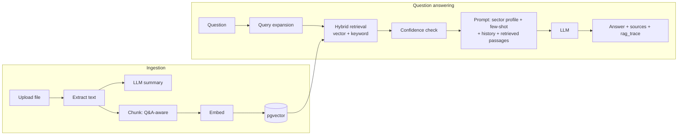

# RAG Agent — Multi-Tenant Document Assistant

An AI assistant for **call-center and support agents**. Administrators upload each client company's knowledge base (FAQs, procedures, policies). Agents then ask questions in natural language — mostly **Greek** — and the assistant answers **strictly from that client's documents**, adapting its tone to the client's **sector** (banking, telecom, energy or general).

It is a full-stack application: a **FastAPI** backend with a **Retrieval-Augmented Generation (RAG)** pipeline on **PostgreSQL + pgvector**, a **React** web dashboard, and a **Chrome/Edge extension** that puts the chat on any webpage. It runs either on a **local LLM (Ollama)** or on the **OpenAI API**.

> 📄 **Project report:** [REPORT.md](./REPORT.md) — a high-level description of the application, its features, and the technologies used.

---

## Contents

1. [Quick start](#1-quick-start)
2. [Prerequisites](#2-prerequisites)
3. [Setup — step by step](#3-setup--step-by-step)
4. [Guided demo (≈10 minutes)](#4-guided-demo-10-minutes)
5. [Browser extension (optional)](#5-browser-extension-optional)
6. [Running the tests](#6-running-the-tests)
7. [Stopping, restarting and resetting](#7-stopping-restarting-and-resetting)
8. [Troubleshooting](#8-troubleshooting)
9. [Configuration reference](#9-configuration-reference)
10. [Project structure](#10-project-structure)
11. [How it works (technical summary)](#11-how-it-works-technical-summary)

---

## 1. Quick start

For readers who already have Docker and [Ollama](https://ollama.com) installed:

```bash
git clone <repository-url> rag-agent
cd rag-agent

ollama pull gemma4            # chat model
ollama pull nomic-embed-text  # embedding model

docker compose up -d --build  # first build takes a few minutes
```

Open **http://localhost:5173** and log in with **`admin@example.com` / `changethis`**.
Then follow the [Guided demo](#4-guided-demo-10-minutes).

Prefer OpenAI instead of a local model? See [Option A](#option-a--openai-api-fastest-answers) before running `docker compose`.

---

## 2. Prerequisites

| Requirement | Needed for | Notes |
|-------------|-----------|-------|
| **Docker Desktop** (or Docker Engine + Compose v2) | Everything | Runs the database, backend and web app. [Install](https://docs.docker.com/get-docker/) |
| **Git** | Cloning the repository | |
| **An LLM** — one of: | Answering questions | |
| &nbsp;&nbsp;• [Ollama](https://ollama.com) (local, free) | Option B | Needs several GB of disk; a GPU makes answers much faster |
| &nbsp;&nbsp;• An OpenAI API key | Option A | Fastest and best answer quality; small usage cost |
| Node.js 18+ and npm | Browser extension only | Optional |
| [uv](https://docs.astral.sh/uv/) (Python package manager) | Running the tests only | Optional |

Ports used on your machine: **5173** (web app), **8000** (API), **5432** (Postgres), **8080** (Adminer), **1080** (Mailcatcher), **80 / 8090** (local proxy).

---

## 3. Setup — step by step

### Step 1 — Get the code

```bash
git clone <repository-url> rag-agent
cd rag-agent
```

All configuration lives in a single **`.env`** file at the repository root. It is already filled in with working local defaults; you only need to choose an LLM option below.

### Step 2 — Choose the LLM

#### Option A — OpenAI API (fastest answers)

Edit `.env` and replace the LLM block with:

```dotenv
LLM_BASE_URL=
OPENAI_API_KEY=sk-...your-key...
OPENAI_MODEL=gpt-4o-mini
OPENAI_EMBEDDING_MODEL=text-embedding-3-small
```

`LLM_BASE_URL` **must be empty** so that requests go to OpenAI rather than Ollama.

#### Option B — Local Ollama (free, private, offline) — *default in `.env`*

1. Install Ollama from https://ollama.com and make sure it is running.
2. Download the two models:

   ```bash
   ollama pull gemma4
   ollama pull nomic-embed-text
   ```

3. `.env` is already configured for this:

   ```dotenv
   LLM_BASE_URL=http://host.docker.internal:11434/v1
   OPENAI_API_KEY=ollama
   OPENAI_MODEL=gemma4
   OPENAI_EMBEDDING_MODEL=nomic-embed-text
   ```

> **Linux only:** Ollama listens on `127.0.0.1` by default, which Docker containers cannot reach. Start it with `OLLAMA_HOST=0.0.0.0 ollama serve` (or set that variable in its systemd service).

On a typical laptop without a GPU, a local model takes **15–30 seconds per answer** and about **30–40 seconds to process a document**. This is normal.

#### Option C — No LLM (smoke test only)

Leave both `LLM_BASE_URL=` and `OPENAI_API_KEY=` empty. The app still runs end to end — documents are indexed, keyword search works, and the chat returns the retrieved passages instead of a generated answer. Useful to check the installation, not to evaluate the AI.

### Step 3 — Start the application

```bash
docker compose up -d --build
```

The first run downloads images and builds the backend and frontend (a few minutes). On start-up the system automatically:

- creates the database and the `pgvector` extension,
- applies all database migrations,
- creates the **administrator** account and two demo customers (*Customer A*, *Customer B*).

Check that everything is up:

```bash
docker compose ps
```

`backend` should show **`(healthy)`** and `db` **`(healthy)`**. `prestart` and `playwright` show **`Exited (0)`** — that is expected: they are one-off jobs (database setup and end-to-end UI tests).

### Step 4 — Open the application

| What | URL |
|------|-----|
| **Web app** | **http://localhost:5173** |
| API documentation (Swagger) | http://localhost:8000/docs |
| Database admin (Adminer) | http://localhost:8080 — server `db`, user `postgres`, password `changethis`, database `app` |
| Captured e-mails (Mailcatcher) | http://localhost:1080 |

**Login:** `admin@example.com` / `changethis` (set by `FIRST_SUPERUSER` and `FIRST_SUPERUSER_PASSWORD` in `.env`).

---

## 4. Guided demo (≈10 minutes)

The [`samples/`](./samples/) folder contains two ready-made knowledge bases in Greek Q&A format:

| File | Content |
|------|---------|
| [`samples/banking_faq.md`](./samples/banking_faq.md) | Lost cards, PIN, SEPA transfers, fees, disputed charges, ATM limits |
| [`samples/telecom_faq.md`](./samples/telecom_faq.md) | No internet, Wi-Fi password, roaming, lost SIM, high bills |

### 4.1 Create two customers (tenants)

1. Log in as the administrator → **Admin** → **Customers** tab → **Add Customer**.
2. Create **`Demo Bank`** with **Sector = Banking**.
3. Create **`Demo Telco`** with **Sector = Telecom**.

### 4.2 Upload a knowledge base for each

1. Go to **Documents** and select **Demo Bank** in the customer selector.
2. **Upload Document** → choose `samples/banking_faq.md` → **Upload**.
3. The status moves `pending → processing → completed` on its own (the list refreshes every 5 s; ~30–40 s with a local model).
4. Switch the selector to **Demo Telco** and upload `samples/telecom_faq.md`.

### 4.3 Chat with the assistant

Go to **Chat**, select **Demo Bank**, and try:

| Ask | What it demonstrates |
|-----|----------------------|
| `έχασα την κάρτα` | Short, informal question → exact phone number and menu path from the document; source shown under the answer |
| `πόσο κοστίζει ένα έμβασμα σε άλλη τράπεζα από το κατάστημα;` | Different wording from the document ("έμβασμα" vs "μεταφορά") is still understood (query expansion + semantic search) |
| `ποιο είναι το επιτόκιο στεγαστικού δανείου;` | Not in the documents → the assistant says so instead of inventing an answer |
| `κάρτα` | Very vague question → the assistant asks which card topic you mean, labelled **Clarification needed** in the UI |

Then select **Demo Telco** and ask `δεν έχω internet στο σπίτι` — the answer comes only from the telecom documents, with numbered troubleshooting steps (telecom tone).

### 4.4 Things to notice

- **Tenant isolation** — ask Demo Telco `ποια είναι η χρέωση για μεταφορά SEPA;`: the answer exists only in Demo Bank's documents, so Demo Telco reports that it has no information. Each customer's knowledge is fully separate.
- **Sources** — every answer lists the documents it was grounded on.
- **Feedback** — use 👍 / 👎 (with a reason) on any answer; it is stored for later quality analysis.
- **Roles** — under **Admin → Users**, create a user with role **Viewer**: they can only chat. A **Moderator** can also manage documents; only the administrator manages customers and users.
- **Behind the scenes** — every answer stores a `rag_trace` (retrieved chunks, scores, expanded queries, confidence, retrieval mode). View it in Adminer → table `chatmessage` → column `rag_trace`.

---

## 5. Browser extension (optional)

A floating chat button on every website, for agents who work inside other tools.

```bash
# from the repository root
cp extension/.env.example extension/.env   # points to http://localhost:8000
npm install
npm run build:extension
```

1. Open `chrome://extensions` (Chrome) or `edge://extensions` (Edge).
2. Enable **Developer mode** → **Load unpacked** → select the **`extension/dist`** folder.
3. Open any website, click the chat bubble (bottom right), log in, pick a customer and chat.

More details and troubleshooting: [extension/README.md](./extension/README.md).

---

## 6. Running the tests

The backend has **129 automated tests** (API routes, RAG pipeline, prompts, chunking, embeddings, security helpers). They always run **without an LLM** (it is mocked), so they are fast and deterministic.

> ⚠️ **Use a separate test database.** The test suite deletes all users, customers, documents and chats when it finishes. The commands below use a dedicated `app_test` database so your demo data is never touched.

Requires [uv](https://docs.astral.sh/uv/) and the Docker stack running (for Postgres).

```bash
# once: create the test database
docker compose exec db psql -U postgres -c "CREATE DATABASE app_test"
docker compose exec db psql -U postgres -d app_test -c "CREATE EXTENSION IF NOT EXISTS vector"

cd backend
uv sync
```

**macOS / Linux / Git Bash:**

```bash
POSTGRES_DB=app_test uv run alembic upgrade head
POSTGRES_DB=app_test uv run pytest
```

**Windows PowerShell:**

```powershell
$env:POSTGRES_DB = "app_test"
uv run alembic upgrade head
uv run pytest
Remove-Item Env:POSTGRES_DB
```

Expected result: `129 passed`.

Code quality checks (same as CI): `uv run ruff check app`, `uv run mypy app`.

---

## 7. Stopping, restarting and resetting

| Action | Command |
|--------|---------|
| Stop everything (data kept) | `docker compose down` |
| Start again | `docker compose up -d` |
| Apply `.env` changes | `docker compose up -d` (recreates changed containers) |
| Rebuild after code changes | `docker compose up -d --build` |
| View backend logs | `docker compose logs -f backend` |
| **Full reset** (deletes the database) | `docker compose down -v` |

Uploaded files are stored in `data/uploads/` on the host.

---

## 8. Troubleshooting

| Symptom | Cause and fix |
|---------|---------------|
| Web app shows a login error or "network error" | Backend still starting. Wait until `docker compose ps` shows `backend (healthy)`; check `docker compose logs backend`. |
| Chat answers *"The AI model is temporarily unavailable…"* | The backend cannot reach the LLM. **Ollama:** is it running (`ollama list`)? On Linux, see `OLLAMA_HOST=0.0.0.0` in Step 2. **OpenAI:** check the API key and that `LLM_BASE_URL` is empty. |
| Chat answers *"I do not have any extracted document content yet"* | No **completed** document for the selected customer. Check the Documents page. |
| Document status is **failed** | The reason is stored with the document (Swagger `GET /api/v1/documents/{id}` → `extracted_data.error`, or Adminer → table `document`). Most common: a scanned PDF with no text layer (only text-based PDFs are supported). |
| Answers are slow (15–30 s) | Normal for a local model without a GPU. Use Option A (OpenAI) for faster responses. |
| Answers look like keyword matches, ignoring synonyms | Embeddings unavailable. Check `OPENAI_EMBEDDING_MODEL` matches your provider (`nomic-embed-text` for Ollama, `text-embedding-3-small` for OpenAI), then re-process the documents (see next row). In Adminer, `rag_trace.retrieval_mode` should read `vector`. |
| Switched LLM provider and search quality dropped | Embeddings from different models are not comparable. Re-process every document: delete and upload it again, or call `POST /api/v1/documents/{id}/reextract` from Swagger. |
| Port already in use | Another program uses 5173/8000/5432/80. Stop it, or change the port mapping in `compose.override.yml`. |

---

## 9. Configuration reference

All settings are in `.env`. The most relevant:

| Variable | Default | Purpose |
|----------|---------|---------|
| `FIRST_SUPERUSER` / `FIRST_SUPERUSER_PASSWORD` | `admin@example.com` / `changethis` | Administrator account created on first start |
| `SECRET_KEY`, `POSTGRES_PASSWORD` | `changethis` | **Change for any non-local deployment** (the app refuses to start in staging/production with these values) |
| `LLM_BASE_URL` | Ollama URL | OpenAI-compatible endpoint; empty = OpenAI |
| `OPENAI_API_KEY` | `ollama` | API key (any value for Ollama) |
| `OPENAI_MODEL` | `gemma4` | Chat / extraction / query-expansion model |
| `OPENAI_EMBEDDING_MODEL` | `nomic-embed-text` | Embedding model for semantic search |
| `LLM_TIMEOUT_SECONDS` | `120` | Maximum wait for one LLM call |
| `RAG_LLM_MAX_TOKENS` | `2048` | Answer length budget (reasoning models need headroom) |
| `RAG_TOP_K` | `5` | Document passages given to the model per question |
| `RAG_CHUNK_SIZE` / `RAG_CHUNK_OVERLAP` | `1500` / `200` | Splitting of non-FAQ documents (characters) |
| `RAG_CHAT_HISTORY_MESSAGES` | `6` | Previous messages kept as conversation context |
| `RAG_MIN_SCORE_FOR_ANSWER` | `0.55` | Below this retrieval score the assistant prefers to ask for clarification |
| `MAX_UPLOAD_SIZE_MB` | `25` | Maximum upload size |

Full list: [`backend/app/core/config.py`](./backend/app/core/config.py).

---

## 10. Project structure

```
├── backend/              FastAPI application
│   ├── app/
│   │   ├── api/routes/   REST endpoints (login, users, customers, documents, chat)
│   │   ├── agents/       Chat agent, extraction agent, prompts, confidence rules
│   │   ├── services/     Chunking, embeddings, retrieval, query expansion, LLM client
│   │   ├── alembic/      Database migrations
│   │   └── models.py     Database tables and API schemas
│   └── tests/            Pytest suite
├── frontend/             React web dashboard (admin, documents, chat)
├── extension/            Chrome/Edge extension (floating chat widget)
├── packages/shared/      Code shared by web app and extension (API client, hooks)
├── samples/              Demo knowledge bases (banking, telecom)
├── compose.yml           Docker services (+ compose.override.yml for local dev)
├── .env                  All configuration
├── REPORT.md             High-level project report
└── development.md / deployment.md   Additional developer and deployment notes
```

---

## 11. How it works (technical summary)



**Ingestion.** An uploaded file (`.txt .md .pdf .csv .json`) is processed in the background: text is extracted, the LLM writes a summary, and the text is split into chunks — FAQ-style `Ερώτηση / Απάντηση` pairs become one chunk each, other text is split by paragraphs with overlap. Each chunk is embedded and stored in PostgreSQL with pgvector.

**Answering.**
1. *Query expansion* — the LLM rewrites the question into several alternative phrasings (more for very short questions), bridging colloquial wording and document wording.
2. *Hybrid retrieval* — each phrasing is searched by cosine similarity in pgvector, restricted to the selected customer's completed documents; if embeddings are unavailable, an accent-insensitive Greek keyword search is used instead. The best passages are kept.
3. *Confidence check* — rules detect low scores, ambiguity between documents, and vague questions; the assistant is then instructed to ask a clarifying question rather than guess.
4. *Sector-aware prompt* — the system prompt combines the customer's sector profile (tone, scope), a sector-specific example, strict grounding rules, the recent conversation and the retrieved passages. If a question clearly belongs to another sector (e.g. an internet question to a bank), that sector's profile is used for the turn.
5. *Answer and trace* — the answer is stored with a `rag_trace` (passages, scores, expanded queries, confidence, retrieval mode) and shown with its source documents; users can rate it.

**Robustness.** The system keeps working when parts fail: no LLM → retrieved passages are shown; no embeddings → keyword search; LLM error or timeout → a clear message instead of a crash; failed summary → document still indexed. The chat endpoint runs in a worker thread so slow model calls never block other users.

**Security and tenancy.** JWT authentication; three roles (viewer, moderator, administrator); passwords hashed with Argon2/bcrypt; every document, retrieval and chat query is filtered by customer; uploaded file paths are validated against path traversal. The platform follows a *shared-agent* model: the call-center's agents may serve any active customer, while each customer's knowledge stays strictly isolated. Restricting agents to specific customers is a natural next step for external, client-facing use.

---

## License & attribution

Built on the [FastAPI Full Stack Template](https://github.com/fastapi/full-stack-fastapi-template) (MIT). Extended with the RAG pipeline, multi-tenancy, sector-aware agents, and the browser extension as a project for an AI Development certification.
