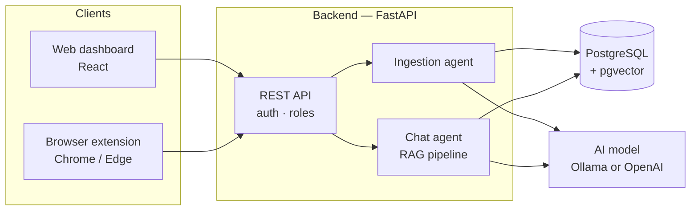

# Project Report — RAG Agent: Multi-Tenant Document Assistant

*AI Development certification project*

---

## 1. Summary

**RAG Agent** is a web application that gives customer-support agents an AI assistant which answers questions **only from their clients' own documents**.

A call center typically serves several client companies — a bank, a telecom provider, an energy supplier — each with its own procedures, phone numbers and policies. Agents lose time searching through long documents while a customer waits on the line. This application lets an administrator upload each client's knowledge base once; agents then simply ask, in everyday Greek or English, *"the customer lost their card, what do I do?"*, and receive a precise, step-by-step answer with the source document named.

The project combines a **Retrieval-Augmented Generation (RAG)** pipeline with a production-style full-stack application: authentication and roles, an admin dashboard, a browser extension, automated tests, and Docker-based deployment. It runs on a free local AI model (**Ollama**) or on the **OpenAI** API.

---

## 2. The problem

| Challenge | Why it matters |
|-----------|----------------|
| Knowledge is spread across long documents | Agents cannot find the exact procedure quickly during a live call |
| Each client has different rules | An answer that is correct for one bank is wrong for another |
| Generic chatbots invent answers ("hallucinate") | Wrong phone numbers or procedures are unacceptable in banking or telecom support |
| Users write short, informal questions | "μπλόκο κάρτα" must still find the "card blocking procedure" |
| Different industries need a different tone | Banking must be precise and security-aware; telecom support is step-by-step troubleshooting |

---

## 3. The solution at a glance

1. An **administrator** creates a *customer* (a client company) and assigns its **sector** — banking, telecom, energy or general.
2. A **moderator** uploads that customer's documents (PDF, Markdown, text, CSV, JSON).
3. The system automatically **reads, summarises, splits and indexes** each document for semantic search.
4. An **agent** selects the customer and asks a question — in the web app or in a browser extension available on any website.
5. The assistant **retrieves the most relevant passages** of that customer's documents only, and the AI model writes an answer **grounded strictly in them**, in the tone of the customer's sector, with the sources listed.
6. If the question is vague, the assistant **asks a clarifying question** instead of guessing; if the documents do not contain the answer, it **says so**.
7. Agents can rate each answer 👍 / 👎, building a record for quality improvement.

### Users and roles

| Role | Can do |
|------|--------|
| **Viewer** (support agent) | Chat with the assistant |
| **Moderator** (knowledge manager) | Chat + upload, edit and delete documents |
| **Administrator** | Everything + manage customers and users |

---

## 4. Features

### 4.1 Multi-tenant knowledge bases
Each client company is a separate **tenant** with its own documents, search index and chat history. Every search is restricted to the selected customer, so an answer for one client can never be based on another client's documents.

### 4.2 Document ingestion
Uploaded files are processed in the background. The system extracts the text, asks the AI model for a short summary, and splits the text into small passages ("chunks"). FAQ-style documents written as *Question / Answer* pairs are recognised automatically, and each pair is kept together as one passage — this makes answers for FAQ material very precise. The document's status (*pending → processing → completed*) updates live in the dashboard.

### 4.3 Semantic search with embeddings
Every passage is converted into an **embedding** — a numerical vector that captures its meaning — and stored in the database. A question is matched by *meaning* rather than exact words, so "έμβασμα" (remittance) finds a passage about "μεταφορά" (transfer).

### 4.4 Hybrid retrieval
When semantic search is unavailable (for example, no embedding model configured), the system automatically falls back to **keyword search** that is tolerant of Greek accents and word endings. The application always returns the best passages it can.

### 4.5 Query expansion
Before searching, the AI model rewrites the user's question into several alternative phrasings. Short, informal questions receive extra variations. This bridges the gap between how people *ask* and how documents are *written*.

### 4.6 Grounded answer generation
The AI model receives the question, the retrieved passages and strict instructions: use only the documents, never invent phone numbers or procedures, keep exact menu names, and state clearly when the information is not available. This is the core anti-hallucination mechanism of the project.

### 4.7 Sector-aware assistant
Each sector has its own **profile** (scope and tone) and a worked **example** of a good answer (*few-shot prompting*). A banking customer gets precise, security-conscious answers; a telecom customer gets numbered troubleshooting steps. If a question clearly belongs to another sector — for example, an internet problem asked to a bank — the assistant adapts its tone for that answer.

### 4.8 Confidence assessment and clarification
The system rates how confident it is in the retrieved passages (low scores, similar passages from different documents, very short questions). When confidence is limited, the assistant is instructed to **ask one or two clarifying questions**, and the interface highlights such replies differently from normal answers.

### 4.9 Transparency and traceability
Every answer lists the **source documents** it was based on. Behind the scenes, each answer also stores a **trace**: the expanded queries, the passages used and their relevance scores, the confidence level and the search method. This supports debugging, evaluation and explainability.

### 4.10 Conversation memory
Recent messages are included when the model answers, so agents can ask follow-up questions naturally ("and if it's a credit card?").

### 4.11 Human feedback
Agents can rate any answer as helpful or not, with a reason (wrong, incomplete, outdated, off-topic). This creates a dataset for measuring and improving answer quality.

### 4.12 Browser extension
A Chrome/Edge extension adds a floating chat button to **every website**, so agents can ask the assistant without leaving their CRM or ticketing tool. It shares its code with the web application.

### 4.13 Local or cloud AI
The same application works with a **local model** through Ollama (free, private — data never leaves the machine) or with the **OpenAI API** (faster, higher quality). Switching is a configuration change only.

### 4.14 Resilience
The application keeps working when parts of the AI stack fail: without a model it still shows the relevant passages; without embeddings it uses keyword search; if the model is unreachable or times out, the user sees a clear message instead of an error page.

### 4.15 Security
Login with secure tokens (JWT), role-based permissions, hashed passwords, per-customer data isolation, file-type and size validation on upload, and protection against malicious file paths. Default passwords are rejected outside local development.

---

## 5. Architecture

- **Clients** — the web dashboard (administration, documents, chat) and the browser extension (chat only) share one code package for talking to the API.
- **Backend** — a REST API that handles security and data, plus two AI components: the *ingestion agent*, which prepares documents, and the *chat agent*, which runs the retrieval-and-answer pipeline.
- **Database** — a single PostgreSQL database stores users, customers, documents and chat history, and — through the *pgvector* extension — also the embeddings used for semantic search. No separate vector database is needed.
- **AI model** — accessed through the OpenAI-compatible interface, so local and cloud models are interchangeable.

---

## 6. Technologies and frameworks

| Area | Technology | Role in the project |
|------|------------|---------------------|
| **Backend language** | Python 3.10 | Main backend language |
| **Web framework** | FastAPI | REST API, automatic interactive documentation (Swagger), background tasks |
| **Data layer** | SQLModel (SQLAlchemy + Pydantic) | Database models and API validation in one definition |
| **Migrations** | Alembic | Versioned database schema changes |
| **Database** | PostgreSQL 18 | Relational data storage |
| **Vector search** | pgvector | Stores embeddings and performs similarity search inside PostgreSQL |
| **AI integration** | OpenAI Python SDK | Chat, summarisation, query expansion and embeddings, for both OpenAI and Ollama |
| **Local AI** | Ollama with Gemma 4 and nomic-embed-text | Free, private, offline language and embedding models |
| **Cloud AI** | OpenAI GPT-4o-mini and text-embedding-3-small | Faster, higher-quality alternative |
| **Document parsing** | pypdf | Text extraction from PDF files |
| **Security** | PyJWT, Argon2 / bcrypt (pwdlib) | Authentication tokens and password hashing |
| **Frontend** | React 19, TypeScript, Vite | Web dashboard |
| **Frontend libraries** | TanStack Router & Query, Tailwind CSS, shadcn/ui | Navigation, data fetching and caching, styling, UI components |
| **Browser extension** | Chrome Manifest V3, React, Vite | Floating chat widget on any website |
| **Shared code** | Generated OpenAPI client (openapi-ts) | Type-safe API access shared by dashboard and extension |
| **Infrastructure** | Docker, Docker Compose, Traefik, Nginx | One-command start-up; reverse proxy and HTTPS in production |
| **Testing** | Pytest, Playwright | Backend unit/integration tests; browser end-to-end tests |
| **Code quality** | Ruff, mypy, ty, Biome, GitHub Actions | Linting, static type checking, continuous integration |
| **Base template** | FastAPI Full Stack Template | Project foundation (authentication, user management, deployment) |

---

## 7. AI concepts demonstrated

| Concept | Where it is used |
|---------|------------------|
| Retrieval-Augmented Generation (RAG) | Answers are generated from retrieved document passages, not from the model's memory |
| Embeddings and vector similarity search | Meaning-based matching of questions to passages |
| Document chunking | Structure-aware splitting of documents, with special handling of Q&A pairs |
| Hybrid retrieval | Vector search combined with keyword search as a fallback |
| Query expansion / rewriting | The model generates alternative phrasings to improve recall |
| Prompt engineering | System prompt with grounding rules, sector profile and a fixed "not found" response |
| Few-shot prompting | One example answer per sector sets format and tone |
| LLM-based summarisation | The ingestion agent summarises each document |
| Confidence estimation and clarification | Rule-based signals decide when to ask instead of answer |
| Observability and explainability | A stored trace and visible sources for every answer |
| Human feedback loop | Ratings with reasons for later evaluation |
| Model-agnostic design | The same code runs on local (Ollama) or cloud (OpenAI) models |

---

## 8. Quality assurance

- **129 automated backend tests** covering the API, the RAG pipeline (chunking, embeddings, retrieval, query expansion, confidence rules, prompts), document ingestion, security helpers and failure scenarios such as an unreachable model. Tests mock the AI model, so they are fast and repeatable.
- **End-to-end browser tests** (Playwright) for login, sign-up, user settings, administration and documents.
- **Static analysis**: Ruff (linting and formatting), mypy and ty (type checking), Biome for the frontend.
- **Continuous integration** on GitHub Actions runs the tests and checks on every change.
- **Manual end-to-end verification** with the included sample knowledge bases (banking and telecom) on a local model: grounded answers with exact phone numbers and menu paths, correct refusals for out-of-scope questions, clarifying questions for vague input, and strict isolation between customers.

---

## 9. Limitations and future work

| Area | Current state | Possible next step |
|------|---------------|--------------------|
| Agent access | Any agent can serve any active customer (internal call-center model) | Assign agents to specific customers for external, client-facing use |
| Scanned PDFs | Only PDFs with a text layer are supported | Add OCR |
| Answer evaluation | Human ratings are collected | Automatic evaluation set (faithfulness, answer relevance) and a feedback dashboard |
| Response speed | 15–30 s per answer on a local model without a GPU | Streaming responses; GPU hosting; answer caching |
| Large collections | Keyword fallback scans a customer's passages in memory | Database full-text search; vector indexes (HNSW) |
| Languages | Tuned for Greek | Language detection and multilingual prompts |

---

## 10. Conclusion

The project delivers a working, end-to-end AI application that tackles a real business problem: giving support agents fast, trustworthy answers from client-specific documentation. It combines the key techniques of modern LLM application development — retrieval-augmented generation, embeddings and vector search, query rewriting, prompt engineering and few-shot prompting, confidence-based clarification, and traceability — inside a secure, tested, multi-tenant web platform that can run entirely on local hardware or on a cloud AI provider.

Setup and a guided demo are described in the [README](./README.md).
